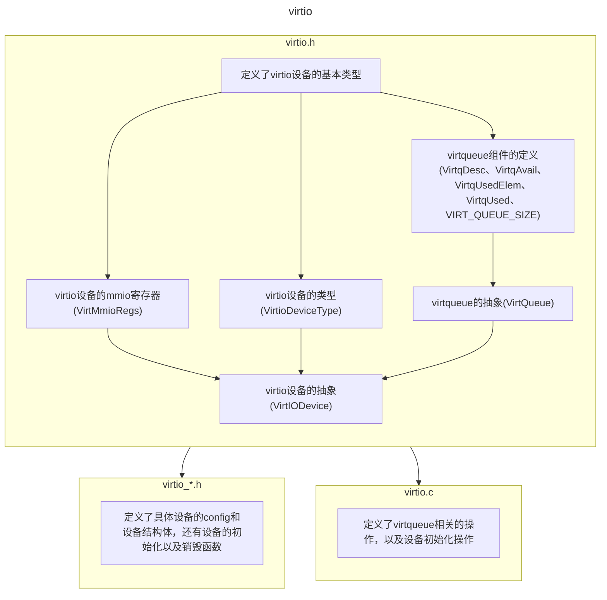
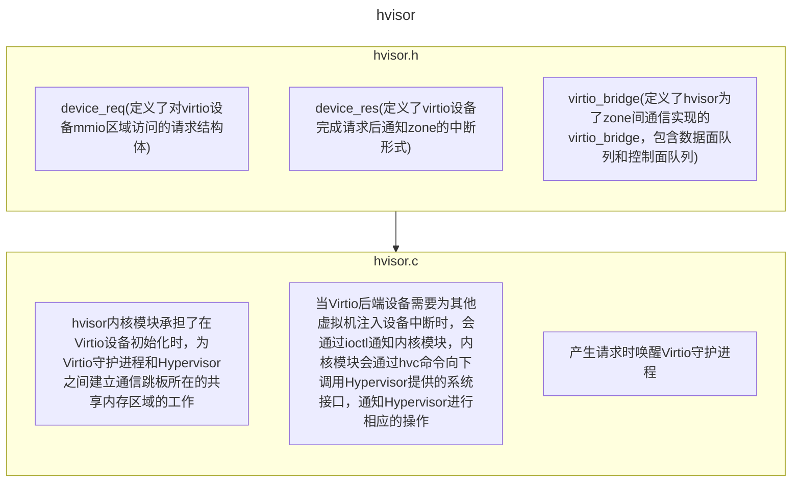

### 定义分布

```mermaid
---
    title: virtio
---
graph TB
    a["定义了virtio设备的基本类型"]
    b["virtio设备的mmio寄存器(VirtMmioRegs)"]
    c["virtio设备的类型(VirtioDeviceType)"]
    d["virtqueue组件的定义(VirtqDesc、VirtqAvail、VirtqUsedElem、VirtqUsed、VIRT_QUEUE_SIZE)"]
    e["virtqueue的抽象(VirtQueue)"]
    f["virtio设备的抽象(VirtIODevice)"]
    g["定义了virtqueue相关的操作，以及设备初始化操作"]
    h["定义了具体设备的config和设备结构体，还有设备的初始化以及销毁函数"]

    subgraph virtio.h
        direction TB
        a --> b
        a --> c
        a --> d
        d --> e
        b --> f
        c --> f
        e --> f
    end

    subgraph virtio.c
        direction TB
        g
    end

    subgraph virtio_*.h
        direction TB
        h
    end

    virtio.h --> virtio_*.h
    virtio.h --> virtio.c
```

```mermaid
---
    title: hvisor
---
graph TB
    a["device_req(定义了对virtio设备mmio区域访问的请求结构体)"]
    b["device_res(定义了virtio设备完成请求后通知zone的中断形式)"]
    c["virtio_bridge(定义了hvisor为了zone间通信实现的virtio_bridge，包含数据面队列和控制面队列)"]
    d["hvisor内核模块承担了在Virtio设备初始化时，为Virtio守护进程和Hypervisor之间建立通信跳板所在的共享内存区域的工作"]
    e["当Virtio后端设备需要为其他虚拟机注入设备中断时，会通过ioctl通知内核模块，内核模块会通过hvc命令向下调用Hypervisor提供的系统接口，通知Hypervisor进行相应的操作"]
    f["产生请求时唤醒Virtio守护进程"]

    subgraph hvisor.h
        direction TB
        a
        b
        c
    end

    subgraph hvisor.c
        direction TB
        d
        e
        f
    end

    hvisor.h --> hvisor.c
```