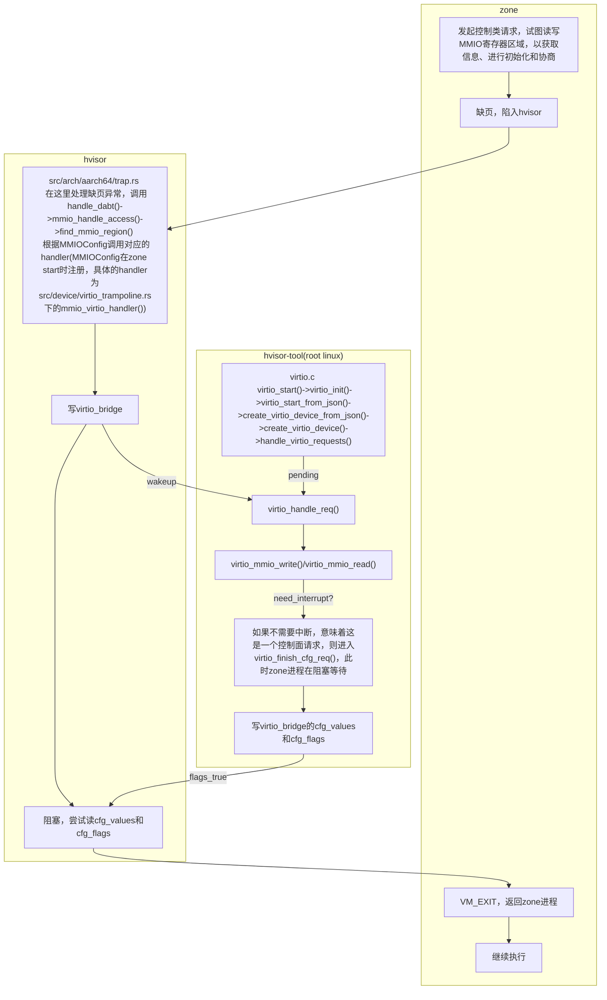
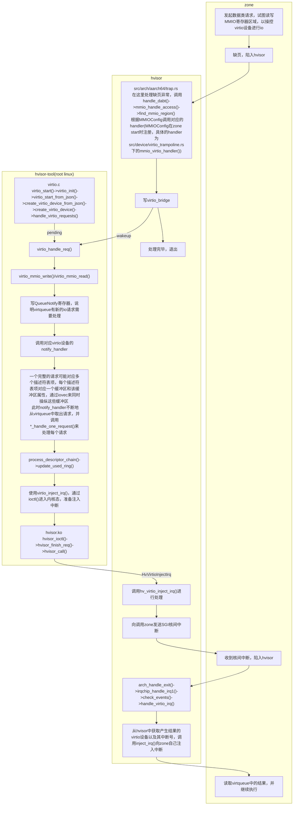

### 控制面请求

```mermaid
graph TB
    a["发起控制类请求，试图读写MMIO寄存器区域，以获取信息、进行初始化和协商"]
    b["缺页，陷入hvisor"]

    c["src/arch/aarch64/trap.rs <br> 在这里处理缺页异常，调用handle_dabt()->mmio_handle_access()->find_mmio_region() <br> 根据MMIOConfig调用对应的handler(MMIOConfig在zone start时注册，具体的handler为src/device/virtio_trampoline.rs下的mmio_virtio_handler())"]
    d["写virtio_bridge"]

    e["virtio.c <br> virtio_start()->virtio_init()->virtio_start_from_json()->create_virtio_device_from_json()->create_virtio_device()->handle_virtio_requests()"]
    f["virtio_handle_req()"]
    g["virtio_mmio_write()/virtio_mmio_read()"]
    h["如果不需要中断，意味着这是一个控制面请求，则进入virtio_finish_cfg_req()，此时zone进程在阻塞等待"]
    i["写virtio_bridge的cfg_values和cfg_flags"]

    j["阻塞，尝试读cfg_values和cfg_flags"]
    k["VM_EXIT，返回zone进程"]
    l["继续执行"]

    subgraph zone
        direction TB
        a --> b
        k --> l
    end
    subgraph hvisor
        direction TB
        b --> c
        c --> d
        d --> j
        j --> k
    end
    subgraph hvisor-tool["hvisor-tool(root linux)"]
        direction TB
        e --pending--> f
        d --wakeup--> f
        f --> g
        g --need_interrupt?--> h
        h --> i
        i --flags_true--> j
    end

```

### 数据面请求

```mermaid
graph TB
    a["发起数据类请求，试图读写MMIO寄存器区域，以操控virtio设备进行io"]
    b["缺页，陷入hvisor"]

    c["src/arch/aarch64/trap.rs <br> 在这里处理缺页异常，调用handle_dabt()->mmio_handle_access()->find_mmio_region() <br> 根据MMIOConfig调用对应的handler(MMIOConfig在zone start时注册，具体的handler为src/device/virtio_trampoline.rs下的mmio_virtio_handler())"]
    d["写virtio_bridge"]

    e["virtio.c <br> virtio_start()->virtio_init()->virtio_start_from_json()->create_virtio_device_from_json()->create_virtio_device()->handle_virtio_requests()"]
    f["virtio_handle_req()"]
    g["virtio_mmio_write()/virtio_mmio_read()"]
    h["写QueueNotify寄存器，说明virtqueue有新的io请求需要处理"]
    i["调用对应virtio设备的notify_handler"]

    j["处理完毕，退出"]

    k["一个完整的请求可能对应多个描述符表项，每个描述符表项对应一个缓冲区和该缓冲区属性，通过iovec来同时操纵这些缓冲区 <br> 此时notify_handler不断地从virtqueue中取出请求，并调用*_handle_one_request()来处理每个请求"]
    l["process_descriptor_chain()->update_used_ring()"]
    m["使用virtio_inject_irq()，通过ioctl()进入内核态，准备注入中断"]
    n["hvisor.ko <br> hvisor_ioctl()->hvisor_finish_req()->hvisor_call()"]
    o["调用hv_virtio_inject_irq()进行处理"]
    p["向调用zone发送SGI核间中断"]

    q["收到核间中断，陷入hvisor"]

    r["arch_handle_exit()->irqchip_handle_irq1()->check_events()->handle_virtio_irq()"]
    s["从hvisor中获取产生结果的virtio设备以及其中断号，调用inject_irq()向zone自己注入中断"]
    t["读取virtqueue中的结果，并继续执行"]

    subgraph zone
        direction TB
        a --> b
        q
        t 
    end
    subgraph hvisor
        direction TB
        b --> c
        c --> d
        d --> j
        o --> p
        p --> q
        q --> r
        r --> s
        s --> t
    end
    subgraph hvisor-tool["hvisor-tool(root linux)"]
        direction TB
        e --pending--> f
        d --wakeup--> f
        f --> g
        g --> h
        h --> i
        i --> k
        k --> l
        l --> m
        m --> n
        n --HvVirtioInjectIrq--> o
    end

```