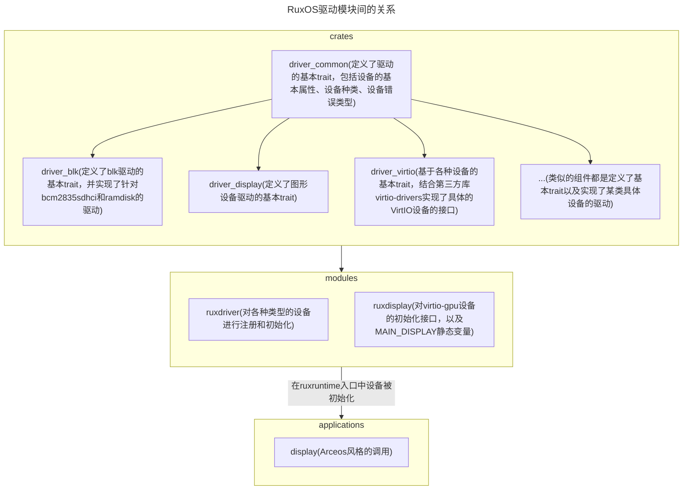

### RuxOS驱动模块间的关系

```mermaid
---
    title: RuxOS驱动模块间的关系
---
graph TB
    a["driver_common(定义了驱动的基本trait，包括设备的基本属性、设备种类、设备错误类型)"]
    b["driver_blk(定义了blk驱动的基本trait，并实现了针对bcm2835sdhci和ramdisk的驱动)"]
    c["driver_display(定义了图形设备驱动的基本trait)"]
    d["driver_virtio(基于各种设备的基本trait，结合第三方库virtio-drivers实现了具体的VirtIO设备的接口)"]
    e["...(类似的组件都是定义了基本trait以及实现了某类具体设备的驱动)"]

    f["ruxdriver(对各种类型的设备进行注册和初始化)"]
    g["ruxdisplay(对virtio-gpu设备的初始化接口，以及MAIN_DISPLAY静态变量)"]

    h["display(Arceos风格的调用)"]

    subgraph crates
        direction TB
        a --> b
        a --> c
        a --> d
        a --> e
    end

    subgraph modules
        direction TB
        f
        g
    end

    subgraph applications
        direction LR
        h
    end

    crates --> modules
    modules --在ruxruntime入口中设备被初始化--> applications
```