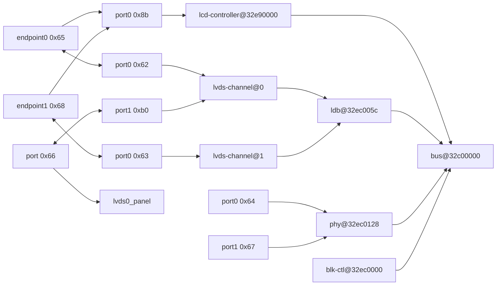

```mermaid
graph LR
    a["bus@32c00000"]

    b["lcd-controller@32e90000"]
    b1["port0 0x8b"]
    b11["endpoint0 0x65"]
    b12["endpoint1 0x68"]

    c["ldb@32ec005c"]
    c1["lvds-channel@0"]
    c11["port0 0x62"]
    c12["port1 0xb0"]
    c2["lvds-channel@1"]
    c21["port0 0x63"]

    d["phy@32ec0128"]
    d1["port0 0x64"]
    d2["port1 0x67"]

    e["blk-ctl@32ec0000"]

    f["lvds0_panel"]
    f1["port 0x66"]

    b --> a
    b1 --> b
    b11 --> b1
    b12 --> b1

    c --> a
    c1 --> c
    c11 --> c1
    c12 --> c1
    c2 --> c
    c21 --> c2

    d --> a
    d1 --> d
    d2 --> d

    e --> a

    f1 --> f

    b11 <--> c11
    b12 <--> c21
    f1 <--> c12
```